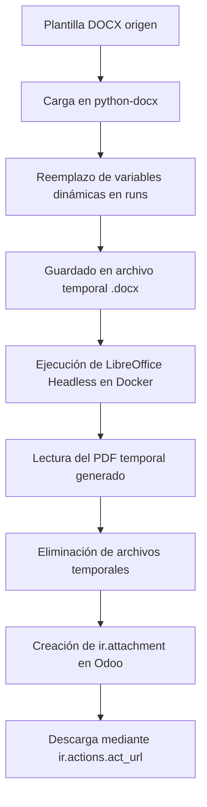

# Base de Conocimiento - Módulo `irg_diploma_graduacion_student`

Este documento describe la arquitectura, las estrategias y los patrones técnicos de implementación utilizados en el módulo de generación de diploma de graduación para estudiantes. Sirve como referencia técnica para futuros desarrollos en la instancia de Odoo 16 de iRG.

---

## 1. Arquitectura y Modelado

La generación de diplomas no se realiza directamente mediante informes QWeb estándar de Odoo, sino mediante un flujo de asistente intermedio (`TransientModel`) debido a la necesidad de parametrización manual antes de imprimir (como la selección del curso concreto o la fecha de expedición) y el uso de plantillas Word.

### Modelos y Vistas
- **`op.student` (`models/op_student.py`)**:
  - Hereda el modelo de OpenEduCat para inyectar un botón de acción rápida (`action_open_graduation_diploma_wizard`) que retorna una acción de ventana (`ir.actions.act_window`) para abrir el wizard.
  - El botón se inserta mediante un XPath en la cabecera de la ficha del estudiante (`views/op_student_views.xml`).
- **`irg.diploma.graduacion.wizard` (`wizard/diploma_graduacion_wizard.py`)**:
  - Un modelo transitorio que gestiona el estado temporal de la solicitud de diploma.
  - Guarda la referencia al estudiante (`student_id`), la matrícula elegida (`student_course_id`) y la fecha de expedición (`date`).
  - Implementa el método `default_get` para rellenar de forma transparente el estudiante a partir del contexto activo.

---

## 2. Estrategia de Reemplazo en Plantillas Word (`python-docx`)

### El problema de la fragmentación de tokens (`runs`)
Al editar un documento en Microsoft Word, el formateo interno o el autoguardado a menudo dividen un texto simple como `<<Alumno>>` en múltiples elementos `<w:r>` (runs) dentro de XML. Por ejemplo, `<<` en un run, `Alumno` en otro y `>>` en el tercero.
Si se realiza un simple reemplazo `run.text = run.text.replace('<<Alumno>>', 'Nombre')`, python-docx no encontrará la coincidencia debido a que el texto completo está dividido.

### La solución implementada: manipulación y limpieza de runs
Se utiliza el método estático `_replace_in_paragraph` que:
1. Reconstruye la cadena de texto completa uniendo el contenido de todos los `runs` del párrafo: `full = ''.join(r.text for r in paragraph.runs)`.
2. Realiza los reemplazos de marcadores en esa cadena unificada.
3. Si hubo algún reemplazo:
   - Sobrescribe la cadena resultante completa en el **primer run** del párrafo: `paragraph.runs[0].text = full`.
   - Vacía los textos de todos los runs subsecuentes utilizando una consulta XPath directa al elemento XML (`w:t` dentro de `run._element`) para evitar dejar residuos vacíos o perder el formateo general del párrafo:
     ```python
     for r in paragraph.runs[1:]:
         for t in r._element.xpath('.//w:t'):
             t.text = ''
     ```

Este método se aplica de forma exhaustiva sobre:
- Párrafos principales (`doc.paragraphs`).
- Celdas de tablas (`doc.tables`).
- Párrafos y tablas en cabeceras y pies de página de todas las secciones (`doc.sections`).

---

## 3. Normalización de Traducción al Catalán

Para renderizar correctamente el diploma bilingüe, es necesario disponer del nombre del curso tanto en español como en catalán. 
- Si el campo traducido `name_cat` existe en el modelo `op.course`, se utiliza; de lo contrario, se hace fallback al campo `name` (español).
- Para garantizar la uniformidad ortográfica y estilística (y evitar errores de entrada manual de datos de los cursos en Odoo), se diseñó la función `_normalize_catalan_course_name` que realiza reemplazos sistemáticos de términos comunes:
  - `"Máster"`, `"máster"`, `"Master"`, `"master"` -> `"Màster"` / `"màster"`.
  - `"Salud"`, `"salud"` -> `"Salut"` / `"salut"`.
  - Conector copulativo `" y "`, `" Y "` -> `" i "` / `" I "`.

Este patrón de normalización asegura que el diploma siempre cumpla con la normativa lingüística correspondiente del catalán.

---

## 4. Pipeline de Renderizado y Conversión a PDF

El flujo de generación de PDF sigue un pipeline robusto sin requerir un motor HTML-to-PDF:



### Proceso de Conversión LibreOffice
El comando ejecutado de forma asíncrona mediante `subprocess.run` es:
```bash
libreoffice --headless --norestore --convert-to pdf --outdir /tmp /tmp/diploma_graduado_xyz.docx
```
- **`--headless`**: Permite la ejecución sin interfaz gráfica (requerido para entornos de servidor/Docker).
- **`--norestore`**: Evita que LibreOffice intente restaurar documentos dañados de sesiones anteriores si hubo fallos, asegurando un tiempo de respuesta rápido y predecible.
- **`--outdir`**: Especifica la carpeta temporal donde se depositará el archivo PDF generado.

### Gestión de Errores y Limpieza
- Si LibreOffice no está instalado (o falla el ejecutable), se captura la excepción `FileNotFoundError` y se lanza un `UserError` guiado al usuario indicando el comando de instalación requerido en el contenedor (`apt-get install -y libreoffice-writer`).
- Se utiliza un bloque `try...finally` (o eliminación preventiva) para asegurar que todos los archivos temporales generados en el disco del servidor se borren tras la lectura binaria (`os.unlink`), previniendo fugas de almacenamiento y colmatación del disco `/tmp`.
- El archivo binario de PDF se almacena en el modelo nativo `ir.attachment` de Odoo, vinculándolo de forma permanente a la ficha del alumno (`op.student`), permitiendo a su vez la descarga directa desde el navegador.
