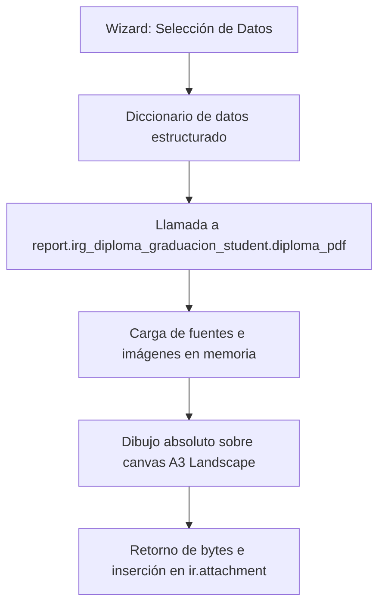

# Base de Conocimiento - Módulo `irg_diploma_graduacion_student`

Este documento describe la arquitectura técnica, las estrategias de diseño y el posicionamiento absoluto en lienzo ReportLab para la generación de diplomas de graduación en Odoo 16. Sirve como referencia técnica de desarrollo y maquetación para la institución.

---

## 1. Arquitectura de Generación en Memoria

La generación de diplomas utiliza un modelo abstracto de Odoo (`AbstractModel`) que hereda la lógica de renderizado dinámico de ReportLab. A diferencia de las vistas tradicionales QWeb, esto permite un control total sobre el motor de renderizado PDF a bajo nivel.



---

## 2. Definición del Canvas A3 y Coordenadas de Dibujo

El diploma está diseñado en orientación **Horizontal (Landscape)** utilizando el tamaño estándar **A3** (1190.55 pt de ancho por 841.89 pt de alto). El origen del sistema cartesiano `(0,0)` se sitúa en la esquina inferior izquierda.

### Coordenadas del Sistema
- **Línea Central X (`center_x`)**: `595.27` pt
- **Eje de Columna Izquierda Catalán (`x1`)**: `297.6` pt
- **Eje de Columna Derecha Castellano (`x2`)**: `892.9` pt

### Estructura de Alturas (Eje Y)

| Elemento | Posición Y (pt) | Alineación | Fuente / Estilo |
| :--- | :--- | :--- | :--- |
| **Título en Español** | `660` | Centrado | `Inter-Bold` o `Helvetica-Bold` (32 pt) |
| **Título en Catalán** | `615` | Centrado | `Inter-Bold` o `Helvetica-Bold` (32 pt) |
| **Nombres del Curso (Cat / Es)** | `510` | Columna (`x1` / `x2`) | `Inter-Bold` (22 pt) |
| **Conector "a"** | `430` | Centrado | `Inter-Regular` (16 pt) |
| **Nombre del Estudiante** | `380` | Centrado | `Inter-Bold` (36 pt), Color Celeste Corporativo |
| **Texto Descriptivo (Bloque)** | `310` (inicio) | Columna (`x1` / `x2`) | `Inter-Regular` (13.5 pt), Salto de 18 pt |
| **Fechas de Expedición** | `220` | Columna (`x1` / `x2`) | `Inter-Regular` (13.5 pt) |
| **Imágenes de Firmas** | `110` | Columna (`x1` / `x2`) | Ancho `160` pt, Alto `60` pt (Proporcional) |
| **Nombre del Firmante** | `80` | Columna (`x1` / `x2`) | `Inter-Bold` (12 pt) |
| **Cargo del Firmante (Línea 1)** | `66` | Columna (`x1` / `x2`) | `Inter-Regular` (12 pt) |
| **Cargo del Firmante (Línea 2)** | `52` | Columna (`x1` / `x2`) | `Inter-Regular` (12 pt) |

---

## 3. Tipografías y Colores Corporativos

### Registro de Fuentes TTF
El sistema intenta registrar la fuente corporativa **`Inter`** dinámica buscando primero en el propio módulo y luego en módulos hermanos de diplomas (`irg_generacion_diplomas`). Si no están disponibles en la ruta local, realiza un fallback automático y transparente a **`Helvetica`** (nativa del visor PDF) para evitar interrupciones de negocio.
- Nombre en Canvas: `Inter` para regular, `Inter-Bold` para negritas.

### Paleta de Colores
Se utilizan colores corporativos definidos en formato RGB normalizado:
- **Azul Oscuro (Títulos)**: `Color(20/255.0, 110/255.0, 180/255.0)` $\rightarrow$ Hex `#146EB4`
- **Celeste / Azul Claro (Estudiante)**: `Color(60/255.0, 160/255.0, 220/255.0)` $\rightarrow$ Hex `#3CA0DC`
- **Negro (Textos y cargos)**: `colors.black`

---

## 4. Estrategia de Text Wrapping (Ajuste de Texto)

Dado que las descripciones del máster pueden variar de longitud según la titulación, y a fin de mantener el diseño bilingüe simétrico, se implementa una rutina de división de textos en ReportLab:

1. Se define un ancho de columna seguro de **`450` pt** para evitar solapamientos centrales.
2. Se utiliza la función nativa `simpleSplit(text, font, size, max_width)` para dividir el texto en una lista de cadenas conforme a la anchura de la columna.
3. Se realiza un bucle en el eje Y restando un valor de `leading` de **`18` pt** entre cada línea para simular un párrafo:
   ```python
   lines = simpleSplit(desc_text, font_regular, 13.5, 450)
   curr_y = 310
   for line in lines:
       c.drawCentredString(col_x, curr_y, line)
       curr_y -= 18
   ```

Esta técnica garantiza que descripciones largas de cursos no se solapen con el nombre del alumno en la parte superior, ni con las firmas en la parte inferior.
